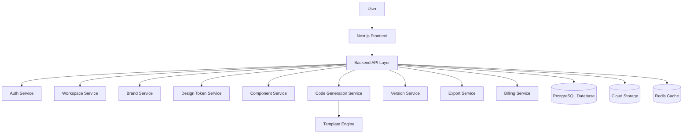
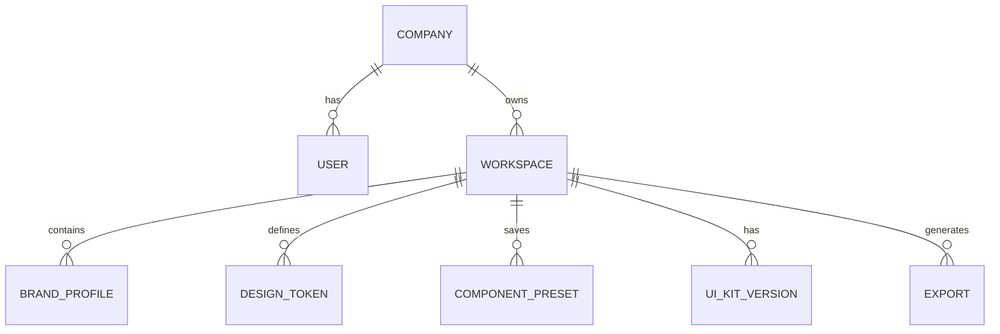
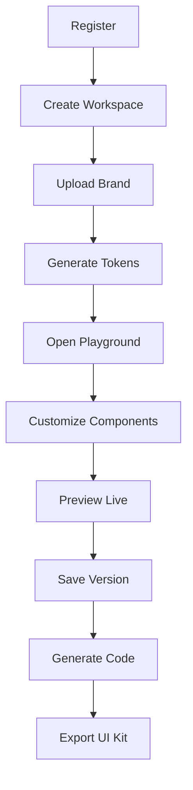

# 🎨 UI Component Customization Platform (SaaS)

A scalable SaaS platform that enables companies to design, customize, manage, and export their own branded UI component libraries using a visual playground.

---

# 🚀 1. System Overview

This platform provides a **UI Component Customization Playground** where organizations can define their design system and generate reusable frontend components.

Instead of manually styling UI components across projects, companies can:

* Define a **brand identity**
* Customize UI components visually
* Generate reusable **production-ready code**
* Maintain **versioned UI kits**

---

## 🧩 Example: Company A Workflow

1. Company A registers and creates a workspace
2. Defines brand identity (logo, colors, typography)
3. Opens component playground
4. Customizes components (buttons, forms, cards)
5. Views changes in real-time preview
6. Saves UI kit version
7. Exports code (React / Tailwind)
8. Integrates into application

---

# 👥 2. Users & Roles

| Role               | Description                        |
| ------------------ | ---------------------------------- |
| Platform Admin     | Manages system, templates, billing |
| Company Admin      | Manages workspace and team         |
| UI/UX Designer     | Designs and customizes components  |
| Frontend Developer | Uses generated code                |

---

# 🧱 3. Core Modules

## 3.1 Authentication & Workspace Management

* User registration/login (JWT/OAuth)
* Multi-tenant company workspaces
* Role-based access control
* Team invitation system

---

## 3.2 Brand Profile Management

Stores company identity:

* Logo
* Primary / Secondary colors
* Fonts
* Border radius
* Shadow styles
* Light/Dark mode

---

## 3.3 Design Token Management

Central design configuration:

```json
{
  "colors": { "primary": "#2563EB" },
  "spacing": { "md": "16px" },
  "radius": { "lg": "20px" }
}
```

Used across all components.

---

## 3.4 Component Playground

Visual editor for UI customization:

Supported components:

* Buttons
* Cards
* Forms
* Tables
* Modals
* Navbars
* Dashboards
* Charts

Customization:

* Colors
* Padding
* Radius
* Typography
* States (hover, disabled)

---

## 3.5 Live Preview Engine

* Real-time rendering
* Responsive preview
* Light/Dark mode
* State simulation

---

## 3.6 Component Template Library

Pre-built templates:

* Button variants
* Forms
* Cards
* Layouts

---

## 3.7 Code Generation Engine

Generates:

* React components
* Next.js components
* Tailwind CSS classes
* CSS variables
* JSON tokens

---

## 3.8 UI Kit Version Control

* Save versions
* Rollback
* Compare changes

---

## 3.9 Export & Integration

* Download ZIP
* Export tokens JSON
* Export CSS variables
* API integration support

---

## 3.10 Admin Dashboard

* Manage users
* Monitor usage
* Manage templates
* View analytics

---

## 3.11 Billing & Subscription

* Free / Pro / Enterprise plans
* Usage-based access control

---

# 🏗️ 4. High-Level Architecture



---

# ⚙️ 5. Technical Architecture

## Frontend

* Next.js + React
* TypeScript
* Tailwind CSS
* shadcn/ui
* Redux (state management)

Responsibilities:

* UI rendering
* Playground interactions
* Live preview
* API communication

---

## Backend

* Node.js + Express / NestJS
* REST API
* JWT Authentication

Responsibilities:

* Business logic
* Data management
* Code generation
* Version control

---

## Database

**PostgreSQL (Recommended)**

Why:

* Structured SaaS data
* Supports JSON fields for tokens

---

## Storage

* Cloudflare R2 / AWS S3

Stores:

* Logos
* Assets
* Exported UI kits

---

## Cache (Optional)

* Redis

Used for:

* Token caching
* Preview configs
* Sessions

---

## Deployment

| Layer    | Platform       |
| -------- | -------------- |
| Frontend | Vercel         |
| Backend  | AWS / Render   |
| Database | Supabase / RDS |
| Storage  | Cloudflare R2  |
| Cache    | Upstash Redis  |

---

# 🗄️ 6. Database Design



---

# 🔌 7. API Design

## Authentication

```
POST /api/auth/register
POST /api/auth/login
GET  /api/auth/me
```

## Workspace

```
POST /api/workspaces
GET  /api/workspaces/:id
```

## Brand Profile

```
POST /api/brand-profile
GET  /api/brand-profile/:workspaceId
PUT  /api/brand-profile/:id
```

## Components

```
GET  /api/component-templates
POST /api/component-presets
```

## Code Generation

```
POST /api/code-generation/component
POST /api/code-generation/ui-kit
```

## Export

```
POST /api/exports
GET  /api/exports/:workspaceId
```

---

# 🔄 8. Company A User Flow



---

# 🎯 9. Example: Button Customization Flow

1. Select Button template
2. Modify:

   * Color
   * Padding
   * Radius
   * Typography
3. Preview instantly
4. Save preset
5. Generate code
6. Export

---

# 🔐 10. Security Considerations

* JWT Authentication
* OAuth support
* Role-based access control
* Company-level data isolation
* API rate limiting
* Input validation
* Secure file upload handling
* Environment variable protection

---

# 📈 11. Scalability Considerations

* Stateless backend services
* CDN for assets
* Redis caching
* Background jobs for exports
* Modular architecture
* Microservice-ready design

---

# 🔮 12. Future Enhancements

* AI-based theme generator
* Figma plugin
* GitHub export
* NPM package generation
* Storybook documentation
* Real-time collaboration
* Accessibility checker

---

# 📌 13. Summary

This platform enables companies to:

* Build consistent design systems
* Customize UI visually
* Generate reusable components
* Scale frontend development efficiently


